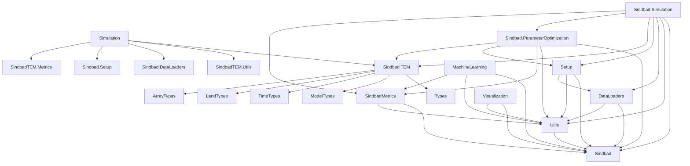

# SINDBAD Packages Overview

This page provides an overview of all SINDBAD packages and their main modules and functionalities.

| Package | Module | Description | Key Features |
|--------|--------|-------------|--------------|
| [Sindbad](sindbad.md) | - | SINDBAD MDI Framework | Top-level orchestration package for **S**trategies to **IN**tegrate **D**ata and **B**iogeochemic**A**l mo**D**els. |
| | [MachineLearning](ml.md) | Machine learning | Machine learning integration and model training |
| | [ParameterOptimization](optimization.md) | ParameterOptimization methods | Parameter optimization and calibration |
| | [Setup](setup.md) | Setup utilities | Configuration of SINDBAD experiments and setup |
| | [Simulation](simulation.md) | Terrestrial Ecosystem Model | Core ecosystem modeling framework |
| | [Visualization](visuals.md) | Visualization tools | Plotting and data visualization helpers |
| [SindbadTEM](sindbadTEM.md) | - | Core terrestrial ecosystem models and types `Sindbad` | Main package for model processes, types, and utils |
| | [Processes](models.md) | Model implementations | Ecosystem model processes and approaches |
| | [Metrics](metrics.md) | Performance metrics | Cost functions, evaluation metrics, and validation tools |
| | [Types](types.md) | SINDBAD Types | Definition of all SINDBAD types and purposes |
| | [Utils](utils.md) | Utility functions | Helper functions and common utilities for all packages |


::: tip `Exported` and `Internal` Sections

In the `automated` documentation,

- `Exported` entities (functions, structs, types, constants):

These are explicitly made available to users using the `export` keyword, allowing them to be accessed without prefixing them with the module name.

- `Internal` entities (non-exported):

These remain accessible but require qualification with the module name (e.g., `MyModule.SomeType`), indicating that they are intended for internal use.

:::


## Package Descriptions

### Core Package
- **SindbadTEM**: The main package that provides the core of SINDBAD.
  - **Models**: Module that implements various ecosystem model components and approaches.
  - **Metrics**: Implements performance metrics and cost functions.
  - **Types**: Module that defines various types for dispatching on methods ranging from setup to cost computation.
  - **Utils**: Provides helper functions and common utilities used across packages.

### MDI Package
#### Modeling Modules
- **Simulation**: Provides the Terrestrial Ecosystem Model framework and its execution, and manages experiment setup, configuration, and simulations.
- **MachineLearning**: Integrates machine learning capabilities for model training and analysis.
- **ParameterOptimization**: Provides methods for parameter optimization and model calibration.

#### Utility Modules
- **DataLoaders**: Handles all data-related operations including input/output, data processing, and management.
- **Setup**: Contains configuration tools for SINDBAD info.
- **Visualization**: Offers tools and helpers for data visualization and plotting.


## Sindbad Package Dependencies


Package Dependency


::: info Package Usage

- Most application packages can be used independently for specific tasks
- The core `Sindbad` and ```Utils``` are required

::: 


